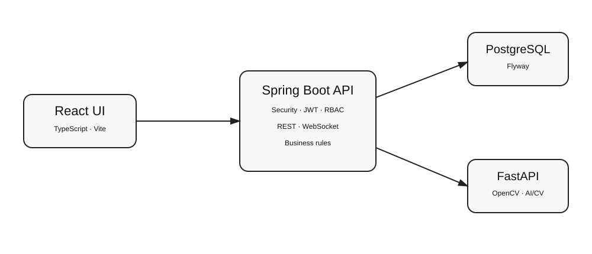

# VisionERP

> **AI-powered workplace management platform combining enterprise software, computer vision, real-time events, analytics and controlled GenAI workflows.**

[Architecture](docs/ARCHITECTURE.md) · [API](docs/API.md) · [Security](docs/SECURITY.md) · [Deployment](docs/DEPLOYMENT.md)

## Why this project
VisionERP is designed as a portfolio-grade system rather than a collection of isolated CRUD screens. The core application demonstrates authentication, role-based authorization, relational data modeling, REST APIs, attendance workflows, visitor operations, notifications, analytics and auditability. A separate Python service provides computer-vision analysis, while the AI assistant follows a tool-controlled architecture so an LLM cannot directly execute arbitrary database queries.

## Stack
- **Frontend:** React, TypeScript, Vite, Recharts, Axios, Lucide
- **Backend:** Java 21, Spring Boot, Spring Security, JWT, JPA, WebSocket/STOMP
- **Database:** PostgreSQL 16 + Flyway migrations
- **AI/CV:** Python 3.12, FastAPI, OpenCV
- **DevOps:** Docker Compose, GitHub Actions
- **API docs:** OpenAPI / Swagger UI

## Product modules
- Authentication and RBAC: ADMIN / HR / SECURITY / EMPLOYEE
- Employee and department management
- Attendance with late/working-duration logic
- Visitor approval and entry/exit lifecycle
- Persistent notifications and real-time event foundation
- Workforce/visitor analytics
- Administrative audit logs
- Controlled AI assistant for authorized workplace-data queries
- Computer-vision image/face-quality analysis service

## Architecture



```text
                     ┌──────────────────────┐
                     │ React + TypeScript UI │
                     └──────────┬───────────┘
                                │ HTTPS / REST
                                ▼
                     ┌──────────────────────┐
                     │ Spring Boot API      │
                     │ Security + Business  │
                     └──────┬────────┬──────┘
                            │        │
                     ┌──────▼───┐ ┌──▼─────────────┐
                     │PostgreSQL│ │ FastAPI AI/CV  │
                     └──────────┘ │ OpenCV         │
                                  └─────────────────┘
```

## Local setup

### Fastest Windows setup

1. Install Docker Desktop and make sure WSL 2 is working.
2. Open a new Command Prompt after Docker Desktop starts.
3. From the project root, double-click `scripts\setup-windows.bat`.
4. Open `http://localhost:5173`.
5. The setup script creates a local `.env` and a generated admin password file named `.visionerp-admin-password`.
6. Login with `admin@visionerp.local` and the password shown in that file.

The setup script generates local-only credentials and leaves an existing `.env` unchanged. `.env` and `.visionerp-admin-password` are ignored by Git. Change all credentials before any non-local deployment.

Manual setup: copy `.env.example` to `.env`, replace the placeholders, and run `docker compose up --build -d`.

Useful endpoints:
- Frontend: `http://localhost:5173`
- API: `http://localhost:8080`
- Swagger: `http://localhost:8080/swagger-ui.html`
- AI docs: `http://localhost:8000/docs`

## Development notes
- Never commit `.env`, credentials, API keys, biometric samples, production data or database dumps.
- Database schema is versioned through Flyway.
- The CV service currently exposes face detection and quality analysis. A production biometric-identification feature requires a validated embedding/recognition pipeline, evaluation protocol, consent, retention/deletion controls and secure biometric-template lifecycle. The project does **not** claim production-grade biometric identification until those requirements are implemented and measured.
- The AI assistant must remain tool-controlled and authorization-aware; it must never be given unrestricted SQL access.

## CI
GitHub Actions builds/tests the Java backend, builds the frontend, and syntax-checks the Python service on pushes and pull requests.

## Roadmap
The repository is intentionally structured for further production hardening: richer automated tests, refresh-token rotation, complete WebSocket event delivery, biometric-template lifecycle, deployment observability, dependency/security scanning and a full AI tool registry.
